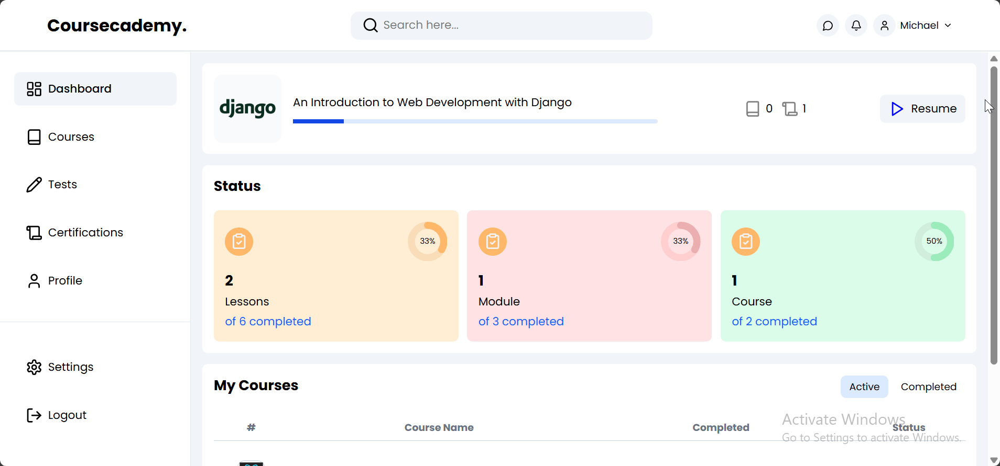
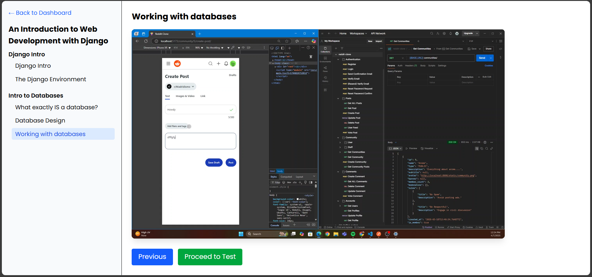
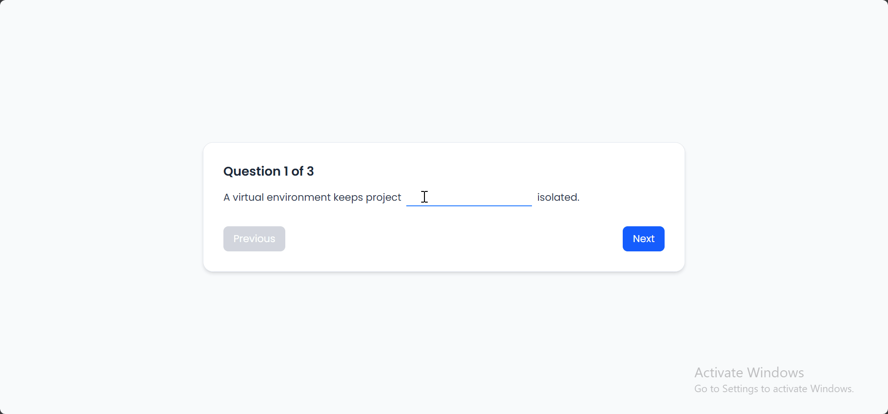
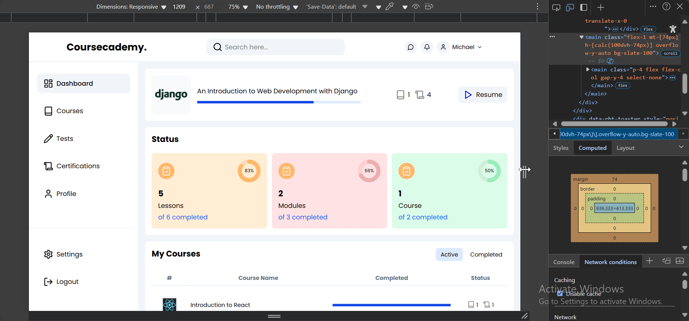

# Coursecademy

## Project Overview
A platform where users/instructors can take/make courses and assessments, built using React on the front-end and Django with DRF on the back-end. This project implements core features you'd expect from any great course platform such as: clean UI, progress recovery, practice tests e.t.c. 
Check it out [here](https://coursecademy.vercel.app/)!

## Features Demo

    
    

    
    

## Technologies Used
### Frontend
- React w/ Typescript
- React Router
- Vanilla + Tailwind CSS
- Axios
- TailwindCSS
- Vite
### Backend
- Django
- Django Rest Framework
- PostgreSQL
- JWT Authentication
- Redis

